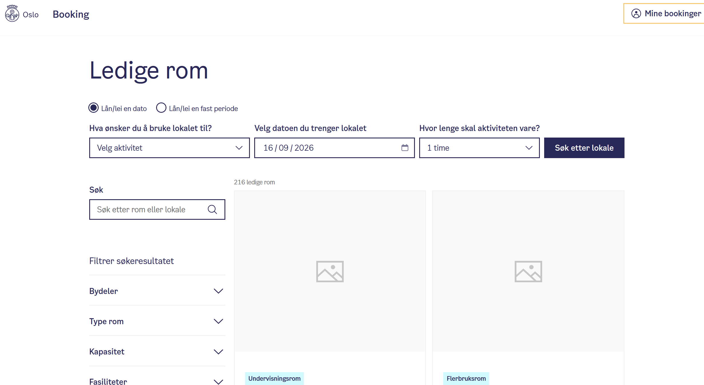

# This is not a booking readme file

Currently this is the best project in the world, please give us A+++ thank you 🥰


## Kjøring av webappen
Naviger til folder ```cd C:\Skole\Webapp\thebooking\src\thebooking```

Kjør kommando ```dotnet watch```
Eller ```dotnet run```

Naviger til ```http://localhost:5190/Room/table``` i nettleser

## thebooking.slnx
Kjørt samtaler med AI ift å bygge prosjektstruktur, og den sier at det er kjekt å ha en solution fil (.slnx). 
Den gir prosjektet en slaks oversikt over hvilke løsninger som er implementert, usikker på hvor nødvendig det er for våres prosjekt men vi ser an. 
Legg til forskjellige solution filer med f.eks:

```dotnet sln thebooking.slnx add src/thebooking/thebooking.csproj``` 

Se om løsningen er lagt til filen riktig med: 
```dotnet sln thebooking.slnx list```


# Frontend notater

Features: 
* Oversikt over rom som er ledige
  * Mulighet for å se romkapasitet
  * Hva slaks type rom det er
* Reserve et rom
* Filtreringsmulighet/Søk (velge bygning, rom, tidspunkt, plasser)
* Se hvilke rombestillinger man har gjort
* Kalender (mulighet for å velge dager/uker/månder)

Grensesnitt å ta inspirasjon fra (Read: Straight up kopier dette)
https://booking.oslo.kommune.no/?loanType=singleLoan&purposes=&date=2026-09-16&datePicker1=2026-09-16&duration=PT1H&searchType=list
